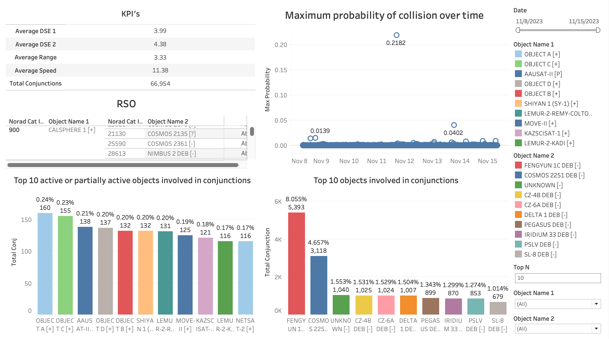

# Digantara-Assessment

## Introduction
This is an assessment involving conjunctions in space that occur when two or more Resident Space Objects (RSOs) in the Earth's orbit pass dangerously close to one another, resulting in possible collision scenarios. Using this data a dashboard was created to visualize these conjunctions.

## Uses
Dashboard to view conjuntions scenarios that occured between 11/8/2023 to 11/15/2023. This dashboard includes various filters that can be used to filter results based on date and satellite names.

## Tools Used
* Tableau

## Developers
* Dylan Dias - @dylandias99 - https://github.com/dylandias99

## Dashboard

